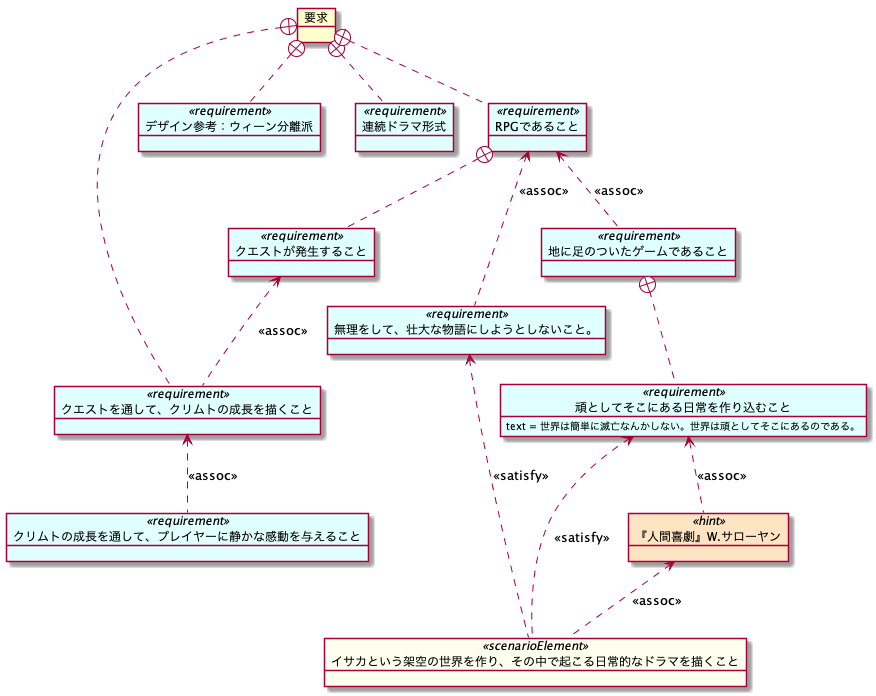

# 『クリムトとアテナ』企画書
『クリムトとアテナ』というゲームの企画です。

各フォルダとファイルの内容は下記の通りです。

|フォルダ又はファイル名     |内容                                             ｜
|------------------------|------------------------------------------------|
|img                     |README.mdで使用している画像ファイルが収められています。|
|LICENSE                 |ライセンスに関する規定です。                          |
|README.md               |当ファイルです。『クリムトとアテナ』の概要が記されています|
|ScenarioTheAmberEyes.pdf|『The Amber Eyes』というシナリオ本編です。           |

## はじめに
この資料には、おおまかに言うと、

-	ゲーム概要
-	ゲーム要求仕様
-	ゲームデザイン
-	シナリオ

が記述されています。

 

画像参照先:<a href="https://www.musey.net/4455">MUSEY パラス・アテナ</a>

 

## 目次
<a href="#gameAbstract">1.ゲーム概要</a>
 
<a href="#genre">&nbsp;&nbsp;&nbsp;1.1.ジャンル</a>
 
<a href="#concept">&nbsp;&nbsp;&nbsp;1.2.コンセプト</a>
 
<a href="#target">&nbsp;&nbsp;&nbsp;1.3.ターゲット</a>
 
<a href="#story">&nbsp;&nbsp;&nbsp;1.4.ストーリー</a>
 
<a href="#developSystem">&nbsp;&nbsp;&nbsp;1.5.開発体制など</a>
 
<a href="#requirement">2.ゲーム要求仕様</a>
 
<a href="#gameDesign">3.ゲームデザイン</a>
 
<a href="#openWorld">&nbsp;&nbsp;&nbsp;3.1.オープンワールド</a>
 
<a href="#SearchAndFight">&nbsp;&nbsp;&nbsp;3.2.探索と戦闘について</a>
 
<a href="#fightingSystem">&nbsp;&nbsp;&nbsp;3.3.戦闘システムについて</a>
 
<a href="#map">&nbsp;&nbsp;&nbsp;3.4.マップ</a>
 
<a href="#scenario">4.シナリオ</a>
 
<a href="#scenarioSample">&nbsp;&nbsp;&nbsp;4.1.シナリオ例『TheAmberEyes』</a>
 
<a href="#requirementDiagram">&nbsp;&nbsp;&nbsp;4.2.『TheAmberEyes』要求図</a>

 
 

## 1.ゲーム概要

### 1.1.ジャンル
-	オープンワールドのRPG

### 1.2.コンセプト
-	伝統的RPGの復権と日常的な世界への回帰

### 1.3.ターゲット
-	RPG黄金時代にゲームをやっていた人々（30代~40代）
-	これからゲームをやろうとしている人々（10代〜20代）
-	壮大で過激な世界に疲れた人へ

### 1.4.ストーリー
-	『イサカ』という架空の世界に暮らす人々の物語。
-	現代よりもっと古い時代のファンタジー。 
-	主人公は画家を目指している騎士クリムトとその庇護者のアテナ。 
-	ストーリーの中心に据えるのは、クリムトの画家としての成長。クリムトは、騎士としての仕事をこなしていく中で、人間的に成長していく。それに伴い画家としても大成していく様を描く。

### 1.5.その他の特徴
-	ユーザーには、連続ドラマのように物語を楽しんでもらいたい。そのため、開発チームは、シナリオごとに開発・リリースという小さいサイクルで、ユーザーにコンテンツを提供していきたい。
-	シナリオの中にクエストがあって、ユーザーはそれをこなしていくことで、物語を進めていく。
-	いくつかクエストをこなすことで、クリムトの人間性が成長する。人間性が成長すると、メインシナリオの進む。
-	クエストをこなすと、そのクエストのテーマになった絵をクリムトが描くようにする。こうして、絵を増やしていき、自分のギャラリーの絵と評判を上げていくことが最終的な目標。

 
 

## 2.ゲーム要求仕様
下記に、このゲームにおける主な要求を列挙していく。

 
 

## 3.ゲームデザイン

### 3.1.オープンワールド
オープンワールドであるが、どちらかというと、古いRPGのようなマップを想定している。通常フィールドと街、というような形を想定。また、街に入る時などは、視点を変えるなどして、ユーザーの意識を変えるような演出を行う。マップについては、世界をぎゅっと凝縮したようなマップにしたい。広大すぎるもの、冗長すぎるものにはしない。ユーザーには戦闘する楽しみだけでなく、冒険する楽しみ。知らない場所へ行くワクワク感などを感じてもらいたい。

 

### 3.2.探索と戦闘について
通常フィールド上には敵も存在している。敵に近づくと、戦闘が発生する。戦闘状態中は、強制的に戦闘しなければならない。敵を倒すか逃げるかして戦闘を終了させると、探索モードへ移行するようにする。  

 

### 3.3.戦闘システムについて
戦闘システムは典型的なRPGのコマンド選択式のターン制の戦闘を想定している。おおまかなフローのイメージは下記の通り。

 

### 3.4.マップ
マップの概要イメージを下記に記す。 
マップは、古代ギリシアの４大元素である「火、水、空気、土」をヒントに、４つ象限に分けた。

４つの象限に分けることによるメリットは下記の通りである。

-	地理的な状況から人々の性格や街の様子、あるいは思想・宗教的な傾向などを特徴付けることが容易になる。 
	例えば、ジャングルは多神教的、火山地帯は異教的、高山地帯では一神教的、リゾート地帯では楽観的・現代的などなど。
-	シンプルで意図的な配置にすることによって、地図上のどこにどんなものがあるか、把握しやすくなる。直感的にわかりやすい。
-	リアリティにこだわるのではなく、世界の特徴を濃密に圧縮することで、プレイヤーに濃い味の世界を感覚してもらうことができる。

 
 

## 4.シナリオ
例として、『The Amber Eyes』というシナリオを考案してみた。テレビドラマ60分程度の長さのものである。

### 4.1.シナリオ例『TheAmberEyes』
例として、シナリオをひとつ用意した。『<a href="./ScenarioTheAmberEyes.pdf">ScenarioTheAmberEyes.pdf</a>』を参照すること。

### 4.2.『TheAmberEyes』要求図
シナリオ作成にあたり、要求図を用いて、シナリオの発想を行なった。 
最終的にできた要求図を下記に示す。

この図は、発想の過程を示したものでもある。どうして琥珀色の目という発想ができたのかなど、発想までの過程がトラッキングできるようになっている。この図を利用することによるメリットは下記の通りである。

-	__物語創出の属人化を防ぐことができる__ 
	物語の創出を、特定の個人のみの技能や暗黙知とするのではなく、言語化し手法化することで、誰でも物語をつくることができるようになる。物語創出のマインドセットを養成することができる。

-	__複数人で物語の創出が可能になる__ 
	物語やゲームの企画をするさい、複数人でひとつの要求図を描くことで、ひとりでは思いつかないような面白いアイディアや連想が湧いてくるはずである。

-	__コミニュケーションの道具になる__ 
	要求図をきちんと書くことで、暗黙知の排除ができる。そのため、誰でもわかるような記述になっている。また、この図は、発想の過程をマッピングしたものなので、「なぜこういう発想に至ったのか？」など、その過程をトラッキングできるようになる。このことが、異なる職種間でのコミニュケーションに役立つはずだ（例えば、シナリオ担当者とデザイナーが会話するときなど）。

-	__感覚を方法論に__ 
	以上のように、要求図の作成を訓練していけば、それまでは職人の感覚で作業していたものを、システム・手法として個人に適用していくことにより、物語創出のマインドセットを醸成できるのではないだろうか。
